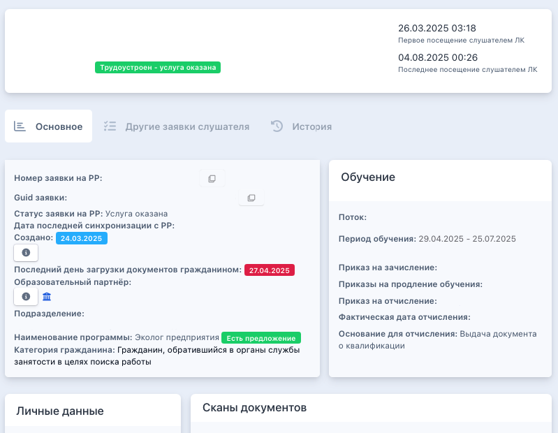

**Страница заявки разделена на 4 блока**

{width=799px height=620px}

[tabs]

[tab:Заявка]

### Информация о текущей заявке гражданина

**Номер заявки на РР**

**Guid заявки**

**Статус заявки на РР**

**Дата последней синхронизации с РР**

**Создано** - дата подачи заявки гражданином

**Последний день загрузки документов гражданином -** указана дата, до которой необходимо загрузить документы

**Образовательный партнёр** - образовательная организация, куда была подана заявка

**Подразделение** - название подразделения в системе Odin, в котором проводится образовательная программа

**Наименование программы -** образовательная программа в системе Odin, на которую была подана заявка.

**Категория гражданина** - категория, по которой была подана заявка на участие.

[/tab]

[tab:Обучение]

### **Обучение**

**Поток** - название потока в Odin

**Период обучения** - даты обучения на платформе Odin

**Приказ на зачисление** - ссылка для скачивания приказа

**Приказы на продление обучения** - если такие будут добавлены

**Приказ на отчисление** - ссылка для скачивания приказа

**Фактическая дата отчисления**

**Основание для отчисления**

[/tab]

[tab:Личные данные]

**Идентификатор гражданина**

**СНИЛС**

**День рождения**

**Пол**

**Данные паспорта**

**Адрес регистрации**

**Почтовый адрес**

**ФИО (в дательном падеже)**

**Образование**

**Сведения о трудовой деятельности**

**Контакты**

**Уточненный фактический адрес**

[/tab]

[tab:Сканы документов]

### **Сканы документов**

**Первичные документы:**

Копия паспорта

Диплом/документ об образовании

Документы о смене фамилии (при наличии)

Нотариально заверенный перевод документа об образовании (при наличии)

**Документы об образовании:**

Заявление на зачисление

Договор

Согласие на обработку персональных данных

Заявление на отчисление (при наличии)

Приказ на зачисление

Приказ об отчислении

**Документы об обучении и трудоустройстве**

Документ о квалификации

Документ о трудоустройстве

Кружочек около каждого документа обозначает следующий статус документа:

{width=586px height=43px}

[/tab]

[/tabs]

[video:https://rutube.ru/video/6b2e5bf4666394267a69e002f2974447/?r=wd]

[video:https://youtu.be/r9Cpyun3d6A]